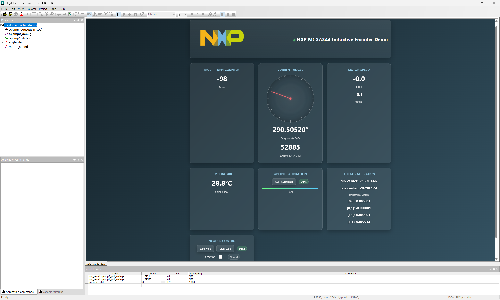
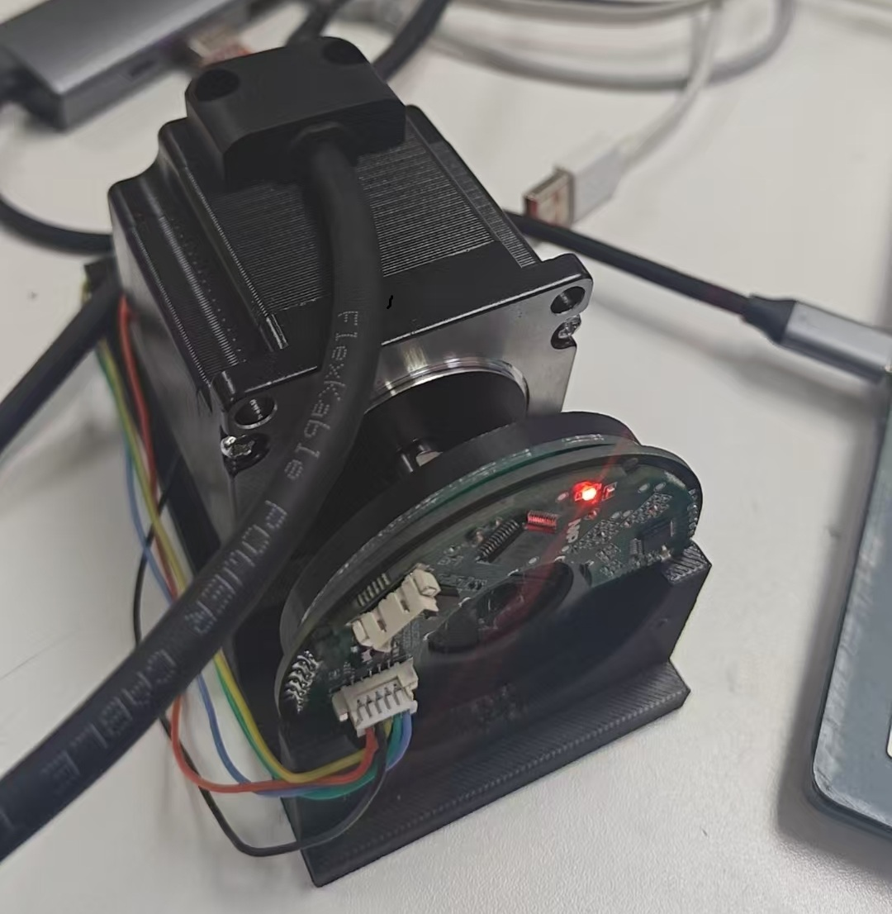
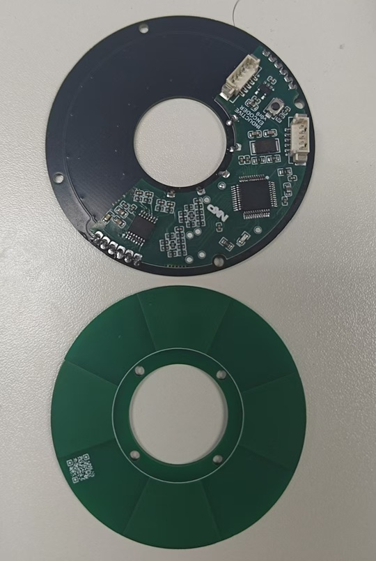

# NXP MCXA344 电感式位置编码器

高精度电感式位置编码器，基于 NXP MCXA344（Cortex‑M33）实现。系统对电感传感器的差分 sin/cos 信号进行校准与角度计算，支持多圈计数，并提供 FreeMASTER 实时可视化界面。



[TOC]

## 概览
- 传感器：差分电感式 sin/cos 输出，片上 OPAMP 调理。
- 采样：双 16 位 ADC 同步采样，CTIMER1 周期中断驱动。
- 计算：2×2 椭圆校正 + 高精度 `atan2` + 多圈展开 + 自适应滤波。
- 可视化：FreeMASTER 桌面 + Web 前端（`freemaster/index.html`）。

## 硬件结构框图
```
[Inductive Sensor]
    └─> OPAMP0 (Sin) ──┐
                        ├─> ADC0/ADC1 同步采样 ──> CTIMER1 周期 ISR (10kHz)
    └─> OPAMP1 (Cos) ──┘                                  │
                                                          ├─ 2×2 椭圆校正（去中心+线性变换）
                                                          ├─ 幅值门限（magnitude ≥ 0.6）
                                                          ├─ 角度计算（高精度 atan2）
                                                          ├─ 多圈展开（4 电角/机械圈）
                                                          └─ 自适应滤波/限幅/死区/量化（16bit）

                                      ┌─ LPUART0 @115200（FreeMASTER PC）
[MCXA344] ──> Encoder Result/ADC ─────┤
                                      └─ LPUART2（可选：485/T‑format 从机示例）
```





### 引脚与接口（摘要）

- OPAMP0_OUT → P2_15 (`ADC0_A2`)，OPAMP1_OUT → P2_19 (`ADC1_A2`)
- 温度传感器 → `ADC0_A26`
- FreeMASTER/调试 UART：`LPUART0 @ 115200`（`Hardware_DebugConsoleInit`）
- 可选 RS‑485 接口：`LPUART2`（`UART485_SetTxRts`），从机示例见 `app_tformat.*`

## 算法原理
- 信号模型与畸变来源
  - 原始：`sin = A_s·sin(θ) + o_s`，`cos = A_c·cos(θ) + o_c`。
  - 受幅值不一致、相位偏差、交叉耦合影响，轨迹在 `(sin, cos)` 平面呈椭圆而非单位圆。
- 去中心与线性变换（2×2）
  - 以样本均值 `(sin_center, cos_center)` 去除 DC 偏置，得到居中向量 `x`。
  - 对居中数据估计协方差矩阵 `Σ`，特征分解得到主轴与尺度；构造 2×2 变换 `T` 使 `T·x` 近似单位圆。
  - 实现细节：对小样本或非法数值回退到最小/最大幅值标定；保证 `det(T) > 0` 的右手坐标系。
- 幅值门限与径向归一
  - 计算变换后的幅值 `m = sqrt(s'^2 + c'^2)`，当 `m < 0.6` 时冻结输出以抑制低信噪比抖动。
  - 正常工作时对 `(s', c')` 做径向归一，提升角度稳定性。
- 角度计算与数值稳定
  - 使用片上 MAU 的高精度 `atan2`（`mau_atan2.*`），计算电角 `θ_e ∈ [0, 360)`。
- 多圈展开与机械角
  - 配置 `ENCODER_ELEC_CYCLES_PER_REV = 4`，跟踪电角穿越次数，得到机械角与多圈计数。
  - 支持方向切换与零位设置（tare/clear），零位仅影响显示角不影响圈计数。
- 自适应滤波、限速与死区
  - 采样周期 `Ts = 0.0001 s`（10kHz），采用简洁的 α‑β 跟踪器，随速度自适应抑制抖动。
  - 新息限幅（例如 20°）、最大角速度限制、输出死区与 16 位量化（0.0055°/count）。
- 温度采样与补偿
  - 每 `TEMP_SAMPLE_INTERVAL = 10k` 次采样读取一次温度，预留热漂补偿接口。

## 快速上手
- 硬件准备
  - MCXA344 开发板、电感式传感器差分接入、3.3V 供电。
  - 连接 `LPUART0` 至 PC（115200），可选连接 `LPUART2`（485）。
- 软件构建（Keil MDK‑ARM）
  - 打开 `ind_encoder.uvprojx` → 选择目标 → 编译→ 下载。
- 上电启动与默认模式
  - 默认运行 FreeMASTER 模式（`main.c` 中 `run_freemaster_mode()`）。
  - 系统时钟打印后启动采样（CTIMER1 10kHz）。

## 使用与调试（含 FreeMASTER）
- 连接参数
  - `LPUART0 @ 115200, 8N1`，无流控。
- FreeMASTER 桌面端
  - 安装 NXP FreeMASTER（Windows）。
  - 选择串口（LPUART0 对应 COM），波特率设为 `115200`，连接设备。
  - 使用 TSA 自动映射变量（项目已开启 TSA），或加载 `freemaster/digital_encoder.pmpx`。
- Web 前端（`freemaster/index.html`）
  - 页面会通过 WebSocket 连接到 FreeMASTER，显示：角度/计数/转速/温度、多圈计数、校准矩阵。
  - 操作：
    - `Start Calibration`：触发在线椭圆拟合并自动应用；进度实时显示。
    - `Zero Here / Clear Zero`：设置或清除零位。
    - `Direction`：勾选切换正/反方向（内部用 `fm_direction`）。

## 性能规格
- 采样/更新率：`10kHz`（`SAMPLE_FRQ = 10*1000`）。
- ADC 分辨率：16 位；信号通道硬件平均 16×。
- 角度分辨率：16 位（约 0.0055°/count）。
- 多圈范围：`int32_t` 计数（±2,147,483,647）。

## 参考变量（FreeMASTER）
- `encoder_result.angle_deg`：机械角（度）。
- `encoder_result.angle_counts`：量化角（0..65535）。
- `encoder_result.turns`：多圈计数。
- `encoder_result.speed_rpm / speed_dps`：转速（RPM/度每秒）。
- `encoder_result.magnitude`：信号幅值质量指标。
- `adc_result.temperature`：温度（°C）。
