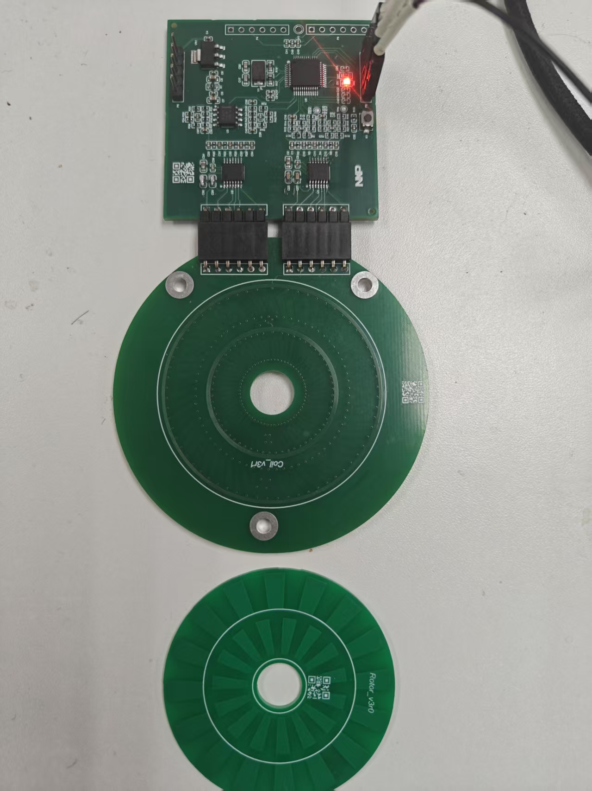

# NXP MCXA344 Dual-Track Inductive Encoder

> English | [中文](README.zh-CN.md)

Firmware for the HW_V2 dual-track inductive absolute encoder based on the NXP
MCXA344. It samples 16/15 Vernier tracks at 10 kHz and provides a native 16-bit
single-turn position through a 2.5 Mbit/s T-Format interface.



## Features

- 16/15 Vernier single-turn absolute-angle solver
- Native 16-bit position output (`0..65535` counts per revolution)
- Per-track offset, gain, quadrature, and ellipse correction
- Runtime center and gain adaptation with automatic persistence
- Branch validation, last-valid-position hold, and controlled re-lock
- Standard T-Format ID0/1/2/3/6/7/8/C/D responder on LPUART2/eDMA
- Persistent zero position and 128-byte encoder EEPROM image
- Compact FreeMASTER status and service page on LPUART0
- DWT execution profiling and dual-ADC sample-pair diagnostics

## Hardware

| Item | Configuration |
| --- | --- |
| MCU | NXP MCXA344VLL, Cortex-M33 with FPU, 180 MHz |
| Analog front end | MCXA OPAMP0/1 and external TLV9062 |
| Sampling | LPADC0/1, four channels, CTIMER0 trigger, 10 kHz |
| Persistent storage | Two 8 KB Flash sectors, 256-byte snapshots, sequence and CRC32 |
| FreeMASTER | LPUART0, 115200 baud, 8N1 |
| T-Format | LPUART2, 2,500,000 baud, 8N1 |

### Signal Wiring

| Signal | MCU connection |
| --- | --- |
| A1 SIN | OPAMP0_OUT -> P2_15 (ADC0_A2) |
| A1 COS | OPAMP1_OUT -> P2_19 (ADC1_A2) |
| A2 SIN | TLV9062 output -> P2_6 (ADC1_A3) |
| A2 COS | TLV9062 output -> P2_7 (ADC0_A7) |
| T-Format TX | P2_2, LPUART2_TXD |
| T-Format RX | P2_3, LPUART2_RXD |
| RS-485 direction | P3_12, `DIR_485`; low for receive, high for transmit |
| Main-loop heartbeat | P3_11 |
| ADC ISR timing probe | P3_0 |

## Repository Layout

```text
source/
  app_adc.{h,c}              Synchronized dual-LPADC sampling
  app_encoder.{h,c}          Hardware-independent encoder algorithm
  app_encoder_runtime.{h,c}  Runtime adaptation, commands, and persistence
  app_encoder_storage.{h,c}  Dual-sector snapshots and CRC32
  app_encoder_defaults.c     Board default calibration
  app_tformat.{h,c}          T-Format responder on LPUART2/eDMA
  app_freemaster.{h,c}       FreeMASTER initialization and TSA table
  hardware_init.{h,c}        Clocks, OPAMP, pins, and utility GPIO

tools/
  tformat_test.py            Standard T-Format Python host

tests/
  encoder_sim.c              Algorithm and dynamic-profile simulation
  tformat_sim.c              Protocol vectors and state-machine tests
  storage_sim.c              Flash snapshot and power-loss injection tests
  stubs/                     Minimal MCU headers so app_tformat.c builds on the host

freemaster/
  index.html                 Compact operator and service page
  digital_encoder.pmpx       FreeMASTER desktop project
```

## Build and Flash

Install Keil MDK with ARMCLANG 6.23 and `NXP.MCXA344_DFP.25.06.00`. Open
`ind_encoder.uvprojx` and build target `ind_encoder`, or run:

```powershell
C:\Keil_v5\UV4\uVision.com -b ind_encoder.uvprojx -t ind_encoder -j0
```

The project targets `MCXA344VLL` and uses the `MCXA34X_256.FLM` download
algorithm. The application image is limited to `0x00000000..0x0003BFFF`.
`0x0003C000..0x0003FFFF` is reserved for persistent encoder data.

## T-Format Interface

The responder follows the public [NXP T-Format definitions](https://github.com/nxp-mcuxpresso/mcuxsdk-core/blob/release/26.03.00-pvw2/drivers/flexio/t-format/fsl_flexio_t-format.h)
and the field layout documented by the [TI T-Format reference design](https://www.ti.com/lit/ug/tidue74f/tidue74f.pdf).

| ID | CF | Function | Response length |
| --- | --- | --- | --- |
| ID0 | `0x02` | Single-turn position | 6 bytes |
| ID1 | `0x8A` | Multi-turn field, fixed to 0 | 6 bytes |
| ID2 | `0x92` | Encoder ID, `ENID=0x10` | 4 bytes |
| ID3 | `0x1A` | Position, ENID, ABM, and ALMC | 11 bytes |
| ID6 | `0x32` | EEPROM write | 4 bytes |
| ID7 | `0xBA` | Error reset | 6 bytes |
| ID8 | `0xC2` | Set and save single-turn zero | 6 bytes |
| IDC | `0x62` | Multi-turn and error reset; ABM remains 0 | 6 bytes |
| IDD | `0xEA` | EEPROM read | 4 bytes |

Every CF byte above is derived, not copied: `sink code 2 | (ID << 3) | (odd parity of
the ID bits << 7)`. Frame lengths, the ALMC bit map, the SF encoder-error field, the
ADF address/busy masks and the CRC polynomial all match the NXP definitions linked
above. `ENID` is the one value that does not come from a specification -- `0x10` is a
placeholder and must be agreed with the drive, since the resolution the drive infers
depends on it.

The UART is `2,500,000 baud, 8N1, idle high, LSB first`. `ABS0/ABS1` contain
the native 16-bit count and `ABS2=0`. Multi-turn fields are always zero. CRC uses
polynomial `x^8 + 1` with initial value 0. Invalid or stale position data is held
at the last valid value and reported as Counting Error through SF and ALMC.

EEPROM writes set the ADF busy bit until the 128-byte image has been saved to
Flash. Configuration writes are performed only while the shaft is stationary.
Unsupported control fields are ignored, and the protocol UART emits no
unsolicited text.

### Python Host

Install pyserial and replace `COM78` with the connected adapter:

```powershell
python -m pip install pyserial
python tools\tformat_test.py --self-test
python tools\tformat_test.py --port COM78 --data-id 0 --count 1000 --verbose
python tools\tformat_test.py --port COM78 --data-id 3 --count 1000
python tools\tformat_test.py --port COM78 --reset position
python tools\tformat_test.py --port COM78 --eeprom-write 0x20 0xA5
python tools\tformat_test.py --port COM78 --eeprom-read 0x20
```

## Calibration and Operation

At startup, the latest valid Flash snapshot is loaded. If storage is empty, the
encoder starts from board defaults, adapts track centers and gains after adequate
rotational coverage, and saves the converged parameters after the shaft becomes
stationary. T-Format reports Counting Error until this initial adaptation locks.

`Zero & Save` and T-Format ID8 require the position to remain within 16 counts
for 0.5 seconds. The firmware averages 64 samples, changes the single-turn zero,
and confirms completion only after Flash verification.

The complete ellipse and quadrature calibration remains available in the
FreeMASTER Service section. It captures 8192 decimated samples while the shaft
is rotated through complete cycles, then saves the solved calibration and zero.

## FreeMASTER

Open `freemaster/digital_encoder.pmpx`, connect LPUART0 at 115200 baud, and open
the embedded web page. The main view contains readiness, angle, speed, status,
and `Zero & Save`. The collapsed Service section contains raw ADC values,
runtime counters, T-Format counters, factory calibration, and configuration
erase. The page polls primary status at approximately 4 Hz and does not use
Scope or Recorder.

## Configuration

| Macro | Value | Purpose |
| --- | --- | --- |
| `ADC_SAMPLE_RATE_HZ` | `10000` | Encoder update rate |
| `ENCODER_CAL_SAMPLE_COUNT` | `8192` | Service calibration samples |
| `ENCODER_TRACKING_BW_HZ` | `100.0f` | Observer bandwidth |
| `ENCODER_TRACKING_ZETA` | `0.707f` | Observer damping ratio |
| `ENCODER_FILTER_HOLD_RESYNC_SAMPLES` | `50` | Re-lock interval after invalid samples |
| `ENCODER_OUTPUT_DEADBAND_DEG` | `0.015f` | Monitoring-angle dead band |
| `ENCODER_ANGLE_COUNT_HYSTERESIS` | `3` | Low-latency count hysteresis |

## Notes

- The product interface is single-turn; ABM and all multi-turn fields are zero.
- Flash erase/program temporarily pauses sampling and T-Format responses.
- EEPROM and zero writes remain busy until the shaft is stationary and the new
  snapshot is verified.
- LPUART0 is reserved for FreeMASTER. DebugConsole and ordinary UART logs are
  not part of the product target.

## License

The project application code is provided under the BSD-3-Clause license; see
[LICENSE](LICENSE). Bundled SDK, CMSIS, and FreeMASTER components retain their
own copyright and license notices.
